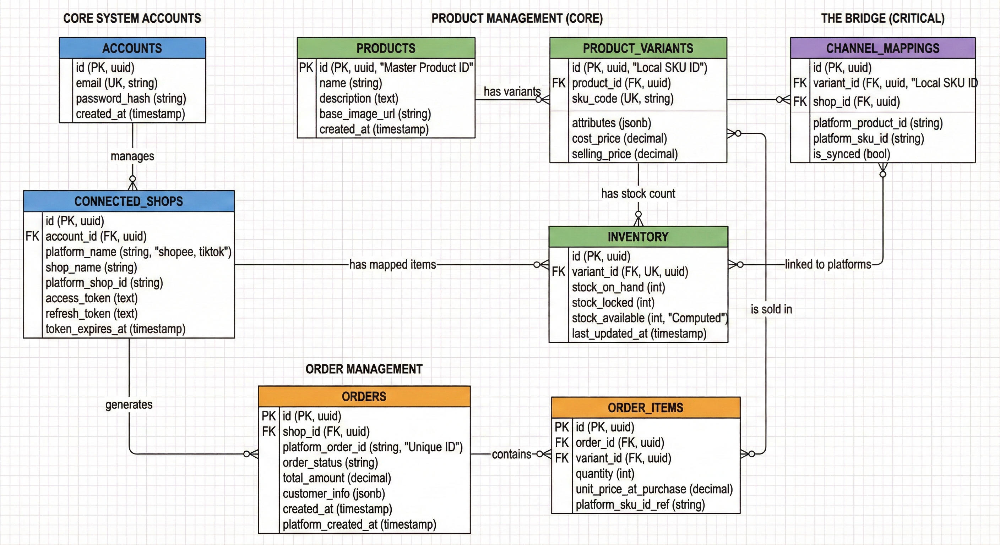

Chúng ta hãy chia nhỏ ERD này thành **4 khu vực chức năng chính** để phân tích chi tiết nhé:

---

### Khu vực 1: CORE SYSTEM ACCOUNTS (Quản lý Tài khoản & Kết nối)

Đây là "cổng vào" của hệ thống, nơi quản lý ai đang dùng phần mềm và họ sở hữu những gian hàng nào.

#### 1. Bảng `ACCOUNTS` (Tài khoản người dùng)
* **Chức năng:** Lưu trữ thông tin đăng nhập của người dùng (chủ shop) sử dụng phần mềm của bạn.
* **Trường quan trọng:**
    * `email (UK - Unique Key)`: Đảm bảo mỗi email chỉ đăng ký một lần.
    * `password_hash`: Lưu mật khẩu đã mã hóa (tuyệt đối không lưu plaintext).

#### 2. Bảng `CONNECTED_SHOPS` (Các shop đã kết nối)
* **Chức năng:** Đây là bảng cực kỳ quan trọng để tích hợp API. Một tài khoản (`ACCOUNTS`) có thể sở hữu nhiều shop trên nhiều sàn khác nhau.
* **Trường quan trọng:**
    * `platform_name`: Cho biết đây là shop "shopee" hay "tiktok".
    * `platform_shop_id`: ID của shop trên sàn (ví dụ ID shop Shopee của bạn).
    * `access_token` & `refresh_token`: Đây là "chìa khóa" để hệ thống của bạn thay mặt chủ shop gọi API của Shopee/TikTok (lấy đơn, cập nhật kho). **Lưu ý: Cần mã hóa các trường này khi lưu xuống DB để bảo mật.**
    * `token_expires_at`: Biết khi nào token hết hạn để dùng refresh token xin cái mới.

---

### Khu vực 2: PRODUCT MANAGEMENT (CORE) (Quản lý Sản phẩm - Lõi)

Đây là trái tim của hệ thống WMS. Dữ liệu ở đây là của riêng bạn, không phụ thuộc vào sàn nào cả.

#### 3. Bảng `PRODUCTS` (Sản phẩm cha / Sản phẩm gốc)
* **Chức năng:** Lưu thông tin chung của một dòng sản phẩm.
* **Ví dụ:** "Áo Thun Polo Basic".
* **Trường quan trọng:** Chỉ lưu tên, mô tả chung, ảnh đại diện chính.

#### 4. Bảng `PRODUCT_VARIANTS` (Phiên bản sản phẩm / SKU)
* **Chức năng:** Đây là đơn vị hàng hóa thực tế bạn cầm nắm và bán được.
* **Ví dụ:** "Áo Thun Polo Basic - Màu Đỏ - Size M".
* **Mối quan hệ:** Một sản phẩm cha (`PRODUCTS`) có nhiều biến thể (`has variants`).
* **Trường quan trọng:**
    * `sku_code (UK)`: Mã SKU nội bộ do bạn tự đặt (ví dụ: `POLO-RED-M`). Mã này nên là duy nhất.
    * **`attributes (jsonb)`**: Điểm mạnh của PostgreSQL. Thay vì tạo nhiều bảng phụ để lưu Size, Màu, Chất liệu... bạn lưu tất cả vào một cột JSON linh hoạt: `{"size": "M", "color": "Red"}`.

#### 5. Bảng `INVENTORY` (Kho hàng)
* **Chức năng:** Quản lý số lượng tồn kho của từng Variant.
* **Tại sao tách riêng bảng này?** Để hiệu năng cao hơn khi cập nhật kho liên tục và dễ dàng mở rộng sau này (ví dụ: nếu bạn có nhiều kho Hà Nội, TP.HCM, chỉ cần thêm cột `warehouse_id` vào bảng này).
* **Mối quan hệ:** Một Variant chỉ có một dòng Inventory tương ứng (`has stock count`).
* **Trường CỰC KỲ QUAN TRỌNG (Logic chống bán kống):**
    * **`stock_on_hand` (Tồn thực tế):** Số lượng hàng đang thực sự nằm trên kệ trong kho (Ví dụ: 10 cái).
    * **`stock_locked` (Tồn đang giữ):** Số lượng hàng đã có người đặt mua nhưng chưa xuất kho đi (Ví dụ: Có 2 đơn mới vào, chưa đóng gói -> locked = 2).
    * **`stock_available` (Tồn có thể bán):** Đây là con số bạn sẽ đẩy lên Shopee/TikTok.
        * Công thức: `stock_available` = `stock_on_hand` - `stock_locked`.
        * (Ví dụ: 10 thực tế - 2 đang giữ = 8 có thể bán tiếp).

---

### Khu vực 3: THE BRIDGE (CRITICAL) (Cây cầu liên kết)

Đây là phần khó nhất và quan trọng nhất của hệ thống đa kênh.

#### 6. Bảng `CHANNEL_MAPPINGS` (Bảng ánh xạ/liên kết)
* **Chức năng:** Nó là cuốn từ điển để dịch giữa "ngôn ngữ của bạn" và "ngôn ngữ của sàn".
    * Hệ thống của bạn gọi cái áo là UUID: `a1b2...`
    * Shopee gọi cái áo đó là ID: `998877`
    * TikTok gọi cái áo đó là ID: `tk_123xyz`
* Bảng này giúp hệ thống biết rằng: "Khi Shopee báo đơn hàng cho sản phẩm `998877`, thì nghĩa là phải trừ kho của sản phẩm `a1b2...` trong hệ thống nội bộ."
* **Mối quan hệ:** Một Variant nội bộ (`PRODUCT_VARIANTS`) có thể được bán trên nhiều shop khác nhau (`linked to platforms`).
* **Trường quan trọng:**
    * `variant_id`: ID sản phẩm nội bộ của bạn.
    * `shop_id`: Sản phẩm này đang liên kết với shop nào.
    * `platform_sku_id`: ID của sản phẩm đó trên sàn (Shopee/TikTok ID).

---

### Khu vực 4: ORDER MANAGEMENT (Quản lý Đơn hàng)

Nơi tập trung tất cả đơn hàng từ mọi nguồn về một mối.

#### 7. Bảng `ORDERS` (Đơn hàng tổng)
* **Chức năng:** Lưu thông tin chung của đơn hàng (Ai mua? Tổng tiền? Từ sàn nào?).
* **Trường quan trọng:**
    * `platform_order_id`: Mã đơn hàng do sàn sinh ra. Cần đánh index unique (kết hợp với `shop_id`) để tránh việc Webhook của sàn bắn bị trùng lặp gây tạo 2 đơn.
    * `customer_info (jsonb)`: Lưu thông tin khách hàng (địa chỉ, sđt) dạng JSON cho nhanh gọn, vì thông tin này từ các sàn thường không đồng nhất cấu trúc.

#### 8. Bảng `ORDER_ITEMS` (Chi tiết đơn hàng)
* **Chức năng:** Đơn đó mua những món gì, số lượng bao nhiêu.
* **Mối quan hệ:** Một đơn hàng có nhiều chi tiết (`contains`). Một chi tiết đơn hàng liên quan đến một Variant (`is sold in`).
* **Trường quan trọng:**
    * **`variant_id (FK)`**: Cực quan trọng. Nó phải trỏ đúng về ID sản phẩm nội bộ của bạn thì mới trừ kho chính xác được.
    * `platform_sku_id_ref`: Lưu lại ID của sàn để tham khảo phòng khi việc mapping bị lỗi.

---

### Kịch bản hoạt động thực tế (Ví dụ minh họa)

Hãy xem hệ thống này vận hành thế nào khi **có một đơn hàng mới từ Shopee**:

1.  **Webhook:** Shopee bắn một cục dữ liệu JSON về server của bạn, báo: "Có đơn mới `SP_ORDER_123`, mua sản phẩm Shopee ID `998877`, số lượng 1".
2.  **Tìm Mapping (Tra từ điển):**
    * Hệ thống cầm ID `998877` chạy vào bảng `CHANNEL_MAPPINGS`.
    * Nó tìm thấy: À, `998877` tương ứng với `variant_id` nội bộ là `UUID-ao-thun-do-M`.
3.  **Xử lý Đơn & Kho (Trong 1 Transaction DB):**
    * Tạo dòng mới trong bảng `ORDERS` (Mã `SP_ORDER_123`).
    * Tạo dòng mới trong `ORDER_ITEMS`, cột `variant_id` điền `UUID-ao-thun-do-M`, số lượng 1.
    * **Quan trọng:** Cập nhật bảng `INVENTORY` của `UUID-ao-thun-do-M`: Tăng `stock_locked` lên 1. (Lúc này `stock_available` tự động giảm đi 1).
4.  **Đồng bộ ngược (Sync):**
    * Hệ thống thấy `stock_available` của cái áo đó đã thay đổi.
    * Nó lại vào `CHANNEL_MAPPINGS`, tìm xem cái áo `UUID-ao-thun-do-M` còn đang bán trên những shop nào nữa (ví dụ còn bán trên TikTok Shop A).
    * Nó lấy ID TikTok của áo đó, và gọi API TikTok để cập nhật số tồn kho mới nhất (đã bị trừ 1), đảm bảo bên TikTok không bán lố.

Hy vọng lời giải thích chi tiết này giúp bạn nắm bắt được linh hồn của thiết kế ERD này!